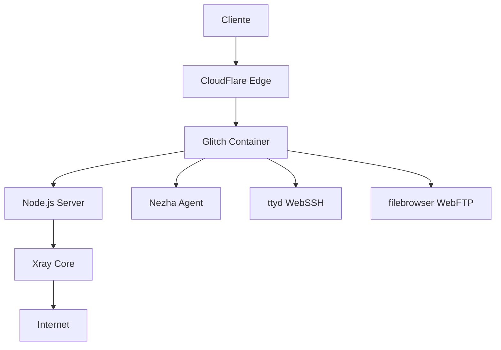

# 📚 Documentação Técnica - Xray para Glitch

## 🏗️ Arquitetura do Sistema

### Componentes Principais



### Fluxo de Dados

1. **Cliente** conecta via protocolos suportados
2. **CloudFlare Argo** redireciona tráfego para Glitch
3. **Node.js** atua como proxy reverso
4. **Xray** processa conexões VPN
5. **Keep-alive** mantém serviços ativos

## 🔧 Estrutura de Arquivos

```
├── .env                 # Configurações ambiente
├── README.md           # Documentação principal
├── entrypoint.sh       # Script de inicialização
├── package.json        # Dependências Node.js
└── server.js          # Servidor principal
```

### Arquivos Gerados em Runtime

```
├── config.json         # Configuração Xray
├── argo.sh            # Script Argo tunnel
├── nezha.sh           # Script Nezha agent
├── ttyd.sh            # Script WebSSH
├── filebrowser.sh     # Script WebFTP
├── auto_del.sh        # Limpeza automática
└── web.js             # Binário Xray
```

## ⚙️ Configuração Detalhada do Xray

### Protocolos e Portas

| Protocolo | Porta Local | Caminho WebSocket |
|-----------|-------------|------------------|
| vless (direct) | 8080 | - |
| vless (ws) | 3002 | `/WSPATH-vless` |
| vmess | 3003 | `/WSPATH-vmess` |
| trojan | 3004 | `/WSPATH-trojan` |
| shadowsocks | 3005 | `/WSPATH-shadowsocks` |

### Configuração WARP

O sistema inclui roteamento inteligente via CloudFlare WARP para:
- `domain:openai.com`
- `domain:ai.com`

## 🌐 Sistema de Proxy Reverso

### Node.js como Gateway

```javascript
// Proxy para Xray
app.use("/", createProxyMiddleware({
    target: "http://127.0.0.1:8080/",
    changeOrigin: true,
    ws: true
}));
```

### Autenticação HTTP Basic

```javascript
const user = auth(req);
if (user && user.name === username && user.pass === password) {
    return next();
}
```

## 🔄 Sistema Keep-Alive

### Monitoramento de Processos

1. **Web Keep-Alive** (10s):
   - Verifica processo `web.js`
   - Reinicia se necessário
   - Faz request HTTP para manter ativo

2. **Argo Keep-Alive** (30s):
   - Monitora `cloudflared`
   - Executa `argo.sh` se inativo

3. **Nezha Keep-Alive** (45s):
   - Verifica `nezha-agent`
   - Reinicia via `nezha.sh`

### Limpeza Automática

```bash
# Remove .git a cada 5 segundos (economia de espaço)
while true; do
    rm -rf /app/.git
    sleep 5
done
```

## 📊 Endpoints de Monitoramento

### `/status` - Processos do Sistema
```bash
ps -ef
```

### `/listen` - Portas em Escuta
```bash
ss -nltp
```

### `/info` - Informações do Sistema
```bash
cat /etc/*release | grep -E ^NAME
```

### `/test` - Teste Read-Only
```bash
mount | grep " / " | grep "(ro,"
```

## 🔐 Configurações de Segurança

### UUID Único
- Usado para autenticação em todos os protocolos
- Pode ser personalizado via variável `UUID`

### Paths WebSocket
- Prefixo configurável via `WSPATH`
- Formato: `/WSPATH-protocolo`

### Autenticação Web
- HTTP Basic Auth
- Credenciais via `WEB_USERNAME`/`WEB_PASSWORD`

## 🚀 Otimizações para Glitch

### Limitações da Plataforma
- **Espaço**: 200MB máximo
- **Sleep**: Aplicação dorme após inatividade
- **Recursos**: CPU/RAM limitados

### Soluções Implementadas
- Limpeza automática de arquivos temporários
- Keep-alive requests para evitar sleep
- Downloads sob demanda de binários
- Configuração mínima de logs

## 🔧 Scripts de Configuração

### `entrypoint.sh`
- Gera todos os arquivos de configuração
- Inicia serviços em background
- Configura ambiente completo

### `argo.sh`
- Baixa CloudFlared automaticamente
- Suporte a JSON e Token
- Configuração de múltiplos domínios

### `nezha.sh`
- Download da versão mais recente
- Verificação de processos duplicados
- Configuração TLS opcional

## 📈 Monitoramento e Logs

### Logs do Sistema
```javascript
console.log("保活-请求主页-命令行执行成功");
console.log("web 正在运行");
console.log("Argo 正在运行");
```

### Verificação de Status
- Processos via `pgrep`
- Portas via `ss`
- Conectividade via `curl`

## 🛠️ Troubleshooting

### Problemas Comuns

1. **Serviço não inicia**:
   - Verificar logs via `/status`
   - Checar configurações `.env`

2. **Conectividade falha**:
   - Validar Argo domain
   - Testar com `/test`

3. **Performance baixa**:
   - Verificar uso de recursos
   - Analisar logs de keep-alive

### Comandos de Debug

```bash
# Verificar processos
pgrep -laf "web.js|cloudflared|nezha"

# Testar conectividade
curl -m5 https://seu-dominio.glitch.me

# Verificar portas
ss -nltp | grep -E "(8080|300[2-5])"
```

---

<div align="center">

**🔧 Documentação Técnica Completa**

*Para dúvidas específicas, consulte os logs do sistema*

</div>
